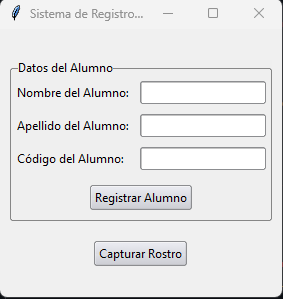
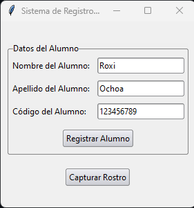
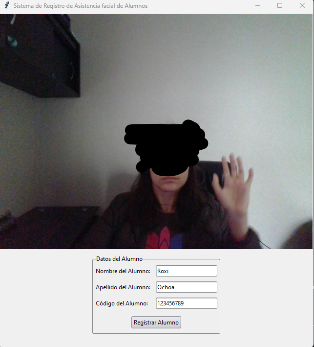
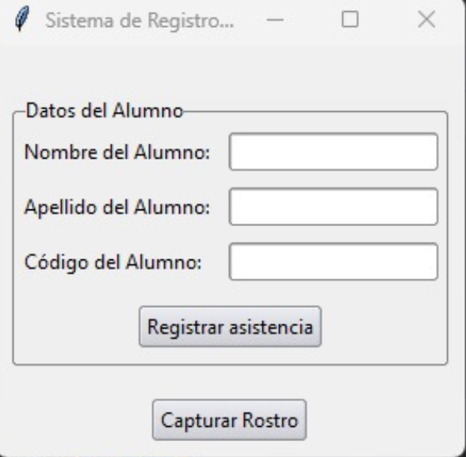
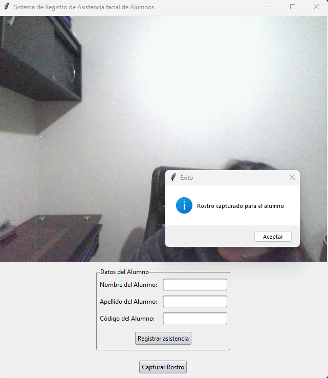
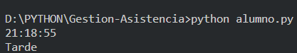

## Gestión de asistencia

### Versión 1.0

#### Librerías de la versión 1.0

    Se importaron las siguientes librerías:

* cv2
* tkinter
* sqlite3
* pillow

### Versión 1.1

#### Librerías de la versión 1.1

    Se importaron las siguientes librerías:

* cv2
* tkinter
* sqlite3
* pillow

### Versión 1.2

#### Librerías de la versión 1.2

    Se importaron las siguientes librerías:

* cv2
* tkinter
* sqlite3
* pillow
    Caracteristicas propias :
    Se crea el objeto alumno y se captura la foto. Respecto a la hora de entrada, se valida si el alumno llego temprano. Si, el alumno
    llega en el horario de 07:00 a 08:15 se encuentra en el rango de temprano. Si pasa de las 8:15 se valida como si fuera tarde.
    
